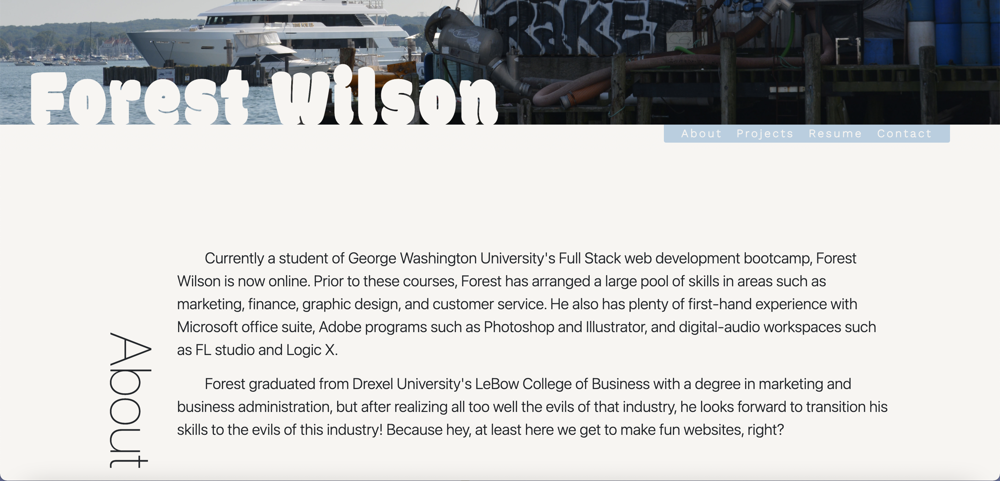
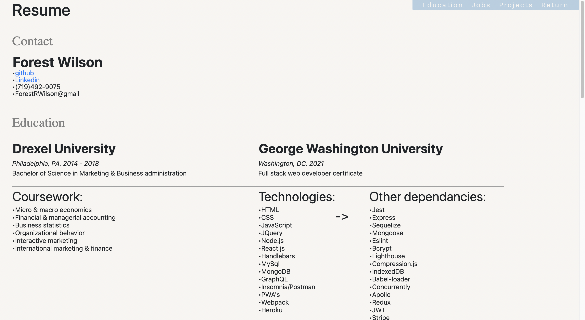
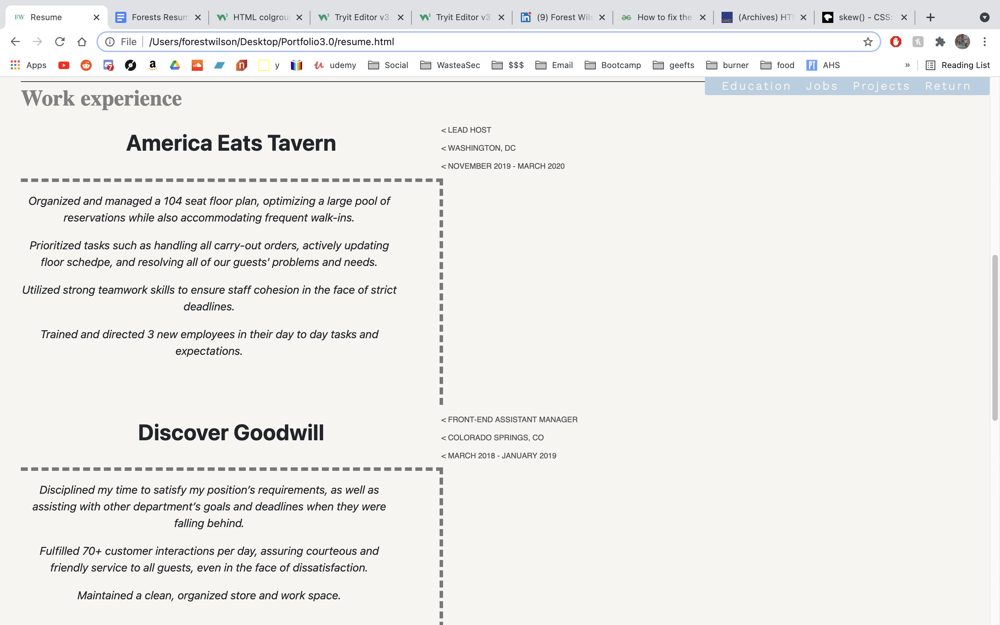
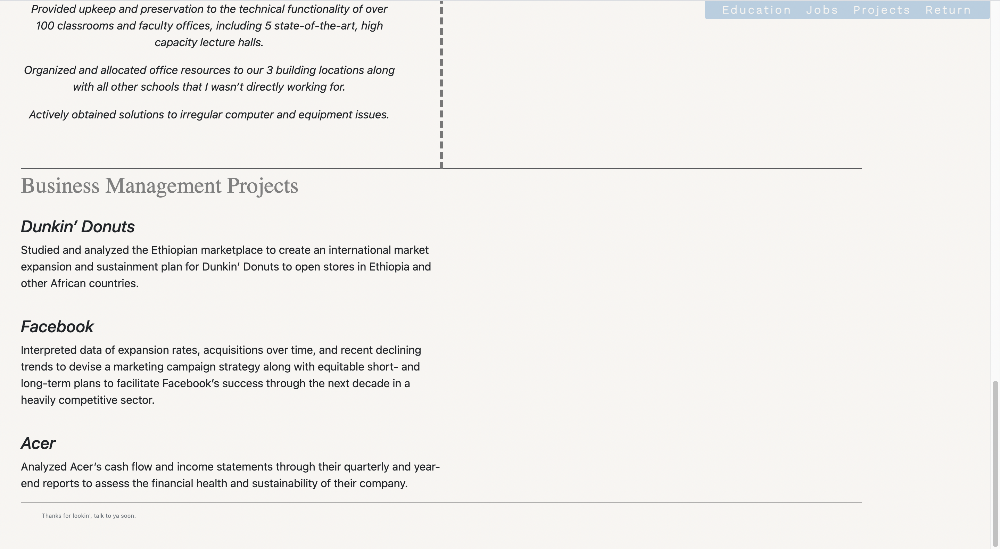

# Forest Wilson

Welcome to portfolio v3.0, because if I'm going to have a portfolio 4.0, I'm going to need a 3.0 first.

## Comments

Well since were in the thick of it now, This is about as much as I will be able to update at this time. I mean, I'm already almost done with my react portfolio so working on this was kind of sad.

Main feature added was the resume page. I decided to just translate my resume into an html table page. I think it works alright, straight and too the point. will probably end up linking my newest portfolio site to this for the resume field until I have time to make a better one for that.

added a few more projects and took notes from TA's comments on inital 2.0 homework feedback, where they said I should make the project card titles something more identifiable. Idk if this is much better, but no time to redesign.

## Issues

motivation

## Bugs

## Screenshots

## Relevant links
[Live site](https://forestw70.github.io/Portfolio3.0/)
 
[Repo](https://github.com/ForestW70/Portfolio3.0)

